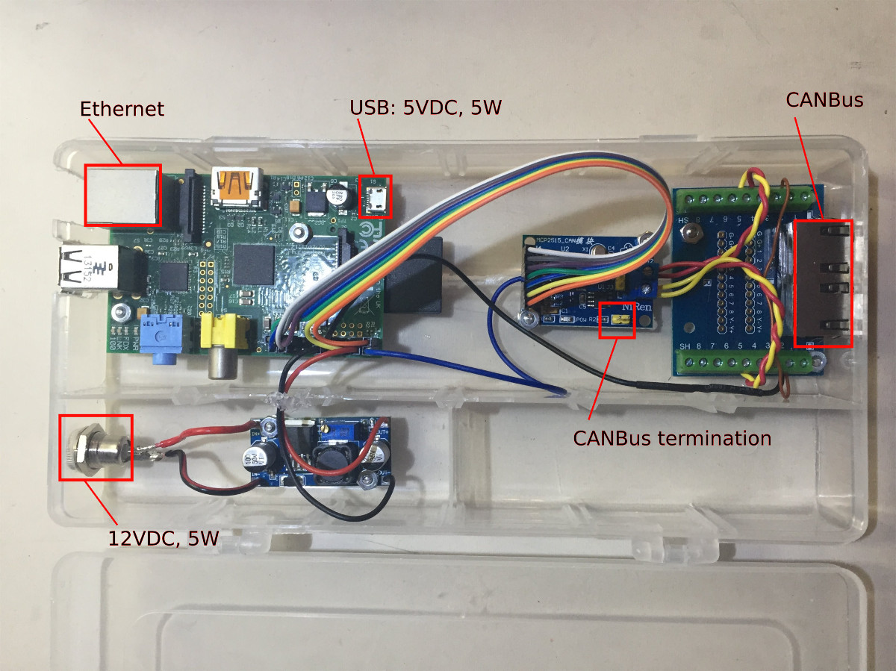

== LG Resu 10 LV Monitor image:https://travis-ci.org/jens18/lgresu.svg?branch=master["Build Status", link="https://travis-ci.org/jens18/lgresu"] image:https://godoc.org/github.com/jens18/lgresu/lgresustatus?status.svg["GoDoc", link="https://godoc.org/github.com/jens18/lgresu/lgresustatus"]

=== Introduction

The http://www.lgchem.com/global/ess/ess/product-detail-PDEC0001[LG Resu 10 LV] Energy Storage System is a very compact Lithium Ion battery made by LG Chem.

The lgresu project provides a server and web based monitoring interface to visualize the main LG Resu 10 LV BMS metrics such as:

* State Of Charge (SOC)
* State Of Health (SOH)
* Voltage
* Current
* Temperature. 

image::doc/lg_resu_dashboard_phone.png[Screenshot,375,660]

lgresu software runs on a Raspberry PI equipped with a CANBus module connected to a LG Resu 10 battery:

=== Documentation: 

lg_resu_mon server: https://github.com/jens18/lgresu/blob/master/doc/LGResuMon.adoc +
lg_resu_dashboard web application: https://github.com/jens18/lgresu/blob/master/doc/LGResuMon.adoc +
lgresustatus API: https://godoc.org/github.com/jens18/lgresu/lgresustatus +
Raspberry PI configuration: https://github.com/jens18/lgresu/blob/master/doc/RPISetup.adoc

