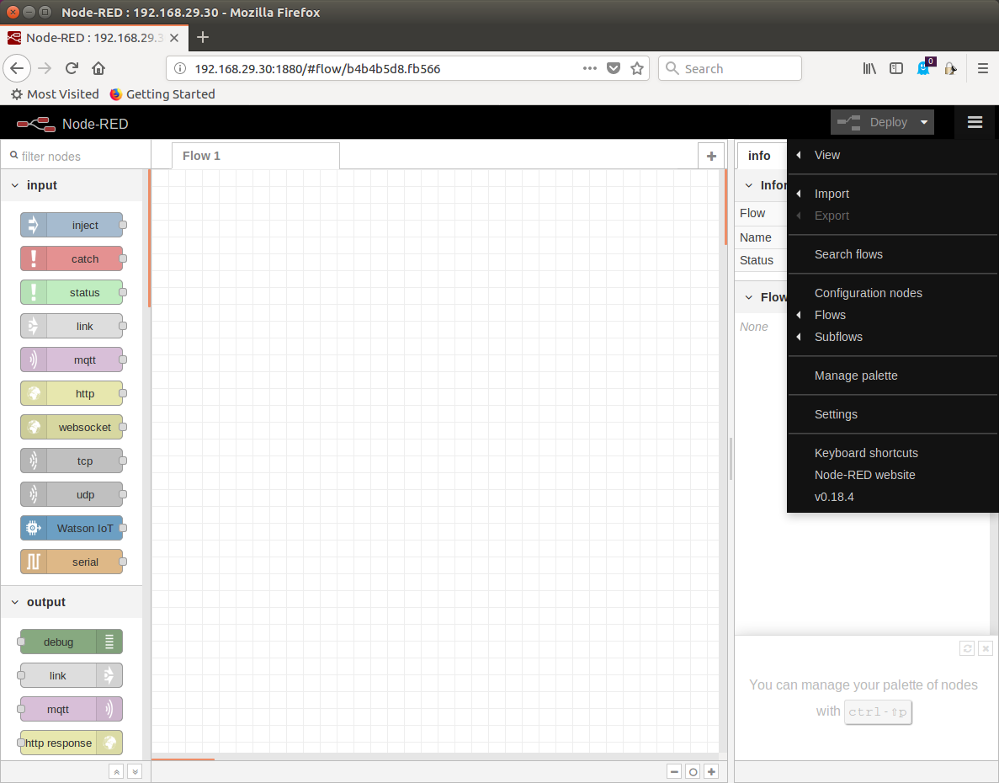
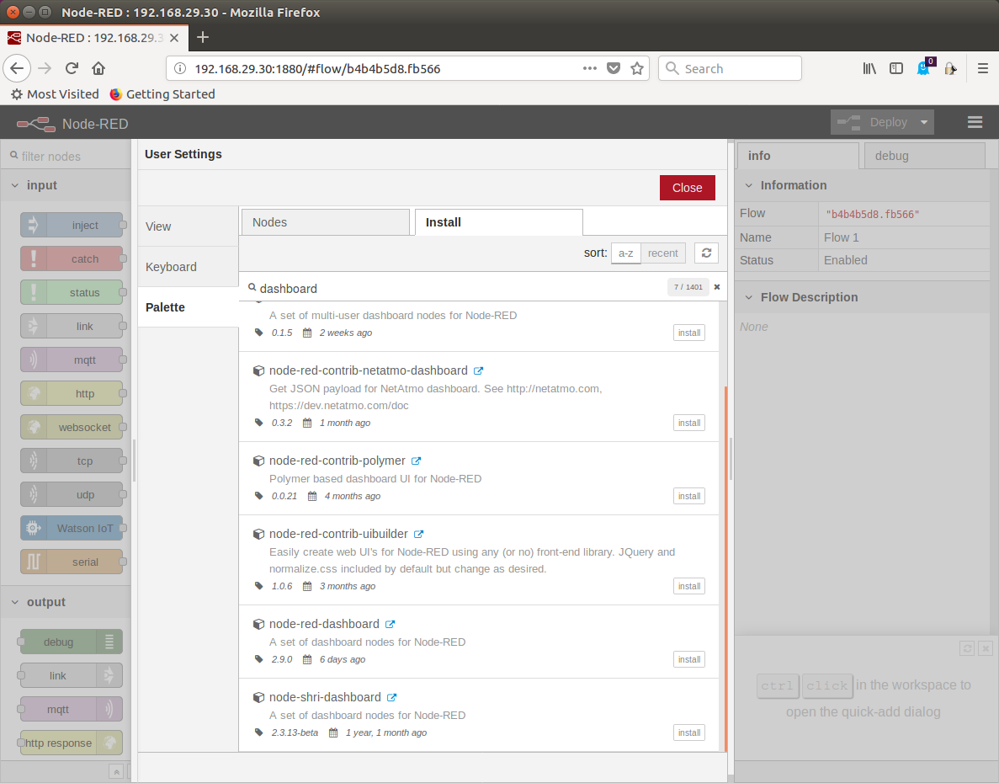
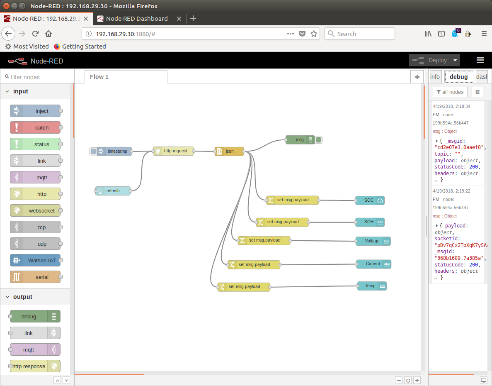
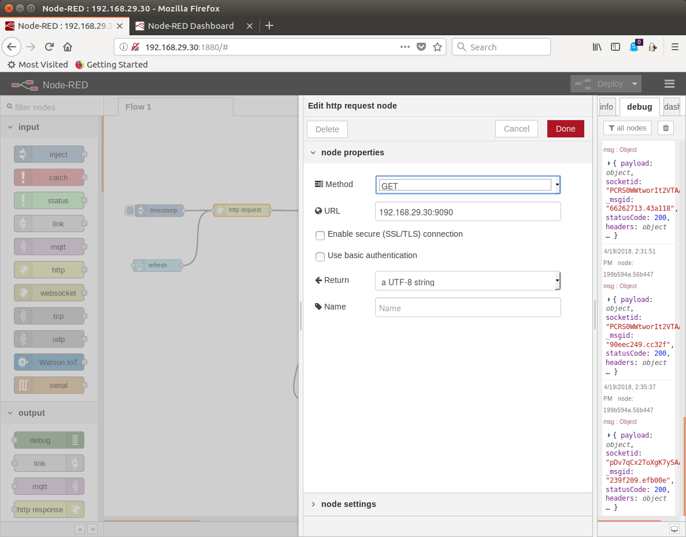
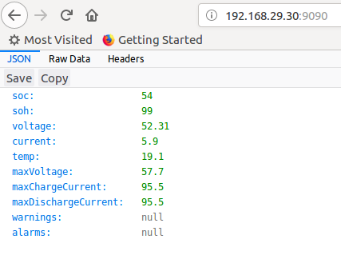

= LG Resu CANBus Monitoring System 
Jens Kaemmerer <jens@mesgtone.net>
v1.1, 04-19-2018
:toc:
:toclevels: 4
:sectnums:

== Hardware configuration

=== Hardware components

The 4 main components of the system are:

==== Raspberry PI 1 model B:

https://en.wikipedia.org/wiki/Raspberry_Pi +

==== CANBus module:

http://ww1.microchip.com/downloads/en/DeviceDoc/21801e.pdf +
https://www.nxp.com/docs/en/data-sheet/TJA1050.pdf

Ebay: http://r.ebay.com/DBujCT 

NOTE: This module is intended to be used with an Arduino and has to be modified 
according to these instructions to work with a Raspberry: https://www.raspberrypi.org/forums/viewtopic.php?t=141052

==== DC-DC buck converter:

http://www.ti.com/lit/ds/symlink/lm2596.pdf +

Ebay: http://r.ebay.com/OGuYa1

Output voltage is set to 5VDC. Input voltage can be as high as 40VDC.

In order connect a DC-DC buck converter directly to the 48VDC LGResu 10 LV battery, the input voltage range has to be as high as 60VDC:

Amazon: http://a.co/gFgr6Gd

==== RJ45 breakout board:

Dual RJ45 Ethernet Connector Breakout Board with screw terminals:

EBay: http://r.ebay.com/MkquWx

image::lg_resu_mon_hardware_1200x800.jpg[]

=== Power 

The system can be powered with either 5VDC (micro USB plug) or
with 12VDC (DC connector: 2.1mm inner diameter, 5.5mm outer diameter).
The powersupply should be able to output 5W continuous.

The Raspberry PI 1 power consumption is less than 3W, the monitoring
software consumes very little CPU time. 

=== Network

The Raspberry PI 1 has a build in 100 MBit Ethernet adapter. A USB Wifi adapter can
be inserted into a USB port.

=== Canbus

==== Connect CANBus Monitoring System at the end of CANBus cable 

A CANBus network needs a 120 Ohm termination resistor at each end of the network.
The LG Resu 10 LV already has one of the termination resistors. The second termination resistor
needs to be enabled with the J1 jumper on the CANBus module (see picture in section: Hardware
components).

The CANBus cable can be inserted into either of the 2 RJ45 ports.

CANBUS network nodes:

----
LG Resu Monitoring system (120 Ohm R) <-> LG Resu 10 LV battery (120 Ohm R) 
----

==== Connect CANBus Monitoring System in between existing CANBus nodes

Addition of the monitoring system at any point between 2 existing CANBus nodes requires that the
termination resistor on the CANBus module is disabled (no jumper on J1).

Two CANBus cables needs to be inserted into the 2 RJ45 ports.

CANBUS network nodes (example):

----
Conext Bridge (120 Ohm R) <-> LG Resu Monitoring system <-> LG Resu 10 LV battery (120 Ohm R) 
----

== Software configuration

=== Software components

SocketCAN CANBus driver:

Raspbian Stretch Lite (Linux kernel 4.9): https://www.raspberrypi.org/ +
SocketCAN (Linux kernel 4.9): https://www.kernel.org/doc/Documentation/networking/can.txt

CANBus command line utilities:

can-utils (0.0+git20161220-1): https://github.com/linux-can/can-utils

LG Resu Monitoring application:

lgresu (1.0): https://github.com/jens18/lgresu

=== CANBus

==== Automated configuration

Configuration of the CANBus interface on the Raspberry PI has been automated in:

`/etc/rc.local`

----
# configure CANBus interface                                                                                                        
/sbin/ip link set can0 type can bitrate 500000 restart-ms 100
/sbin/ifconfig can0 up
/sbin/ifconfig can0
/usr/bin/candump -n 5 can0
----

==== Manual configuration

The required speed for a CANBus node communicating with the LG Resu 10 LV is 500 kBit/s.

CANBus speed needs to be specificed when configuring the Linux SocketCAN interface:

----
# /sbin/ip link set can0 type can bitrate 500000 restart-ms 100
----

The interface can be started with:

----
# /sbin/ifconfig can0 up
----

and stopped with:

----
# /sbin/ifconfig can0 down
----

Display interface details:

----
$ ifconfig can0
ifconfig can0
can0: flags=193<UP,RUNNING,NOARP>  mtu 16
        unspec 00-00-00-00-00-00-00-00-00-00-00-00-00-00-00-00  txqueuelen 10  (UNSPEC)
        RX packets 868643  bytes 6949144 (6.6 MiB)
        RX errors 0  dropped 97  overruns 0  frame 0
        TX packets 8502  bytes 68016 (66.4 KiB)
        TX errors 0  dropped 0 overruns 0  carrier 0  collisions 0
----

NOTE: It is normal to see `dropped` packets (in the example: 97). This number will increase
until a CANBus application (for example: `candump`) connects to the interface for the first time.

=== DHCP

DHCP is enabled.

A _static lease_ can be configured in the router for the MAC address contained in the output of
the `ifconfig` command:

----
# ifconfig eth0
eth0: flags=4163<UP,BROADCAST,RUNNING,MULTICAST>  mtu 1500
        inet 192.168.29.34  netmask 255.255.255.0  broadcast 192.168.29.255
        inet6 fe80::10ad:7c00:43c6:c9ef  prefixlen 64  scopeid 0x20<link>
        ether b8:27:eb:d9:82:b1  txqueuelen 1000  (Ethernet)
        RX packets 2451  bytes 131185 (128.1 KiB)
        RX errors 0  dropped 2  overruns 0  frame 0
        TX packets 432  bytes 74969 (73.2 KiB)
        TX errors 0  dropped 0 overruns 0  carrier 0  collisions 0
----

The example MAC address is: 

----
b8:27:eb:d9:82:b1
----

=== SSH

Logging into the LG Resu Monitor system is possible using any SSH client:

----
$ ssh -l pi 192.168.X.Y
----

login: pi +
password: raspberry

NOTE: `raspberry` is the default `pi` user password for Rasbian and should be changed.

=== sudo

Login as the super user `root` is only possible via `sudo`:

----
$ sudo bash
#
----

`sudo` is enabled for the regular user `pi`.

=== HDMI

HDMI can be permantently disabled to reduce power consumption by removing the # character in front of the
`tvservice` command in `/etc/rc.local`:

----
# turn HDMI circuit off
# /usr/bin/tvservice -o
----

WARNING: With HDMI disabled, it will not be possible to connect the Raspberry PI to a monitor / keyboard
in the event a network connection can not be established. 

HDMI can be re-enable with the command:

----
$ /usr/bin/tvservice -p
----

=== logrotate

Logfile rotation for the logfiles generated by the LG Resu CANBus Monitoring System has been configured in:

----
# more /etc/logrotate.d/lgresu
/opt/lgresu/log/*.log {
  missingok
  notifempty
  compress
  size 20k
  daily
  copytruncate
}
----

=== lgresu

==== Package directory structure

The currently used `lgresu` software package is installed in the directory:

`/opt/lgresu`

The `lgresu' software package contains the following files:

----
lgresu
├── bin
│   └── lg_resu_mon
├── doc
│   └── LgResuMon.pdf
├── script
│   ├── can_stats.sh
│   ├── keep_alive.sh
│   ├── lg_resu_dashboard.json
│   └── start_interface.sh
└── start_lg_resu_mon.sh
----

The startup of the `lg_resu_mon` server program with the script `start_lg_resu_mon.sh` is integrated with the
Rasbian operating system startup in:

`/etc/rc.local`

----
# lg_resu_mon
/opt/lgresu/start_lg_resu_mon.sh
----

The manual startup command is:

----
# /opt/lgresu/start_lg_resu_mon.sh
----

Verify that the `lg_resu_mon` process has been started:

----
# pgrep -a lg_resu_mon
2087 ./bin/lg_resu_mon -if can0
----

==== Package installation

The `lgresu` software package file name is: `lgresu-1.2-linux-armv7l.tar.gz`

NOTE: This package has been build on an `armv7l` system (Raspberry PI 3) but can also be used on an `armv6l` system (Raspberry PI 1).

Stop the existing `lg_resu_mon` process instance and verify that the process has been stopped:

----
# pkill lg_resu_mon
# ps -ef |grep lg_resu_mon
----

Extract the `lgresu` software package with the commands:

----
# cd /opt
# tar xvfz /home/pi/lgresu-1.2-linux-armv7l.tar.gz
----

This will create a new directory: `/opt/lgresu-1.2`

Remove the existing `lgresu` symbolic link:

----
# rm lgresu
----

Create a a new symbolic link to the `lgresu` software version you would like to use:

----
# ln -s lgresu-1.2 lgresu
# ls -l
total 12
lrwxrwxrwx 1 root root   10 Apr 19 11:52 lgresu -> lgresu-1.2
drwxr-xr-x 6 pi   pi   4096 Apr 19 11:52 lgresu-1.2
----

==== Server: Command line parameters

The `lg_resu_mon` server support the following commandline parameters:

----
# ./lg_resu_mon --help
                                 
Usage of ./lgresu_mon:
  -d string
    	log level: debug, info, warn, error (default "info")
  -dr string
    	root directory for metric datafiles (default "/opt/lgresu")
  -if string
    	network interface name (default "vcan0")
  -p string
    	port number (default "9090")
  -r int
    	metric datafile retention period in days (default 7)
----

Changes to the default parameters can be persisted by updating the script `start_lg_resu_mon.sh`.

==== UI: node-RED flow import

The `lg_resu_mon` UI requires a http://node-red.org[node-RED] environment. node-RED can be
installed on the Raspberry PI or on any other machine in the network.

The `/opt/lgresu/script/lg_resu_dashboard.json` node-RED flow implements the LG Resu Monitoring
dashboard web application.

===== Install node-RED dependencies

The `lg_resu_dashboard` flow depends on the additional node-RED node: `node-red-dashboard`

`node-red-dashboard` can easily be added to the `pallete` of node-RED nodes.

Start by connecting to your node-RED instance:

http://<ip_address_node_red_server>:1880

----
Menu -> Manage Palette -> tab: Install -> search: node-red-dashboard
----

Click the small `install` button on the right side of the `node-red-dashboard` entry (if it is not already installed).

Restart the node-RED environment:

----
$ node-red-stop
$ node-red-start
----

===== Import LG Resu Monitoring node-RED flow

Cut and Paste the entire Json file: `/opt/lgresu/script/lg_resu_dashboard.json`

----
Menu -> Import -> Clipboard
----

Click `Import` button. You should now see the following flow:

Doubleclick the HTTP request node to update the current IP address with the IP address of the
machine running the `lg_resu_mon` server:

Deploy the customized flow with the `Deploy` button in the upper right corner.

You can now test the flow by clicking on the pad to the left of the `timestamp` inject node. This will trigger
a HTTP request to the `lg_resu_mon` server. You should see the result of this request in the `debug`
tab on the right side of the node-RED screen.

== Monitoring

=== HTTP: Monitoring Dashboard UI

The LG Resu Monitoring dashboard can be accessed at:

http://<ip_address_node_red_server>:1880/ui

image::lg_resu_dashboard_phone.png[Screenshot,375,660]

=== HTTP: Json message 

`lg_resu_mon` listens to HTTP REST requests on port 9090: 

http://<ip_address_lg_resu_mon_server>:9090

and responds with a JSON message containing the LG Resu metrics.

Wget:

----
$ wget http://192.168.29.30:9090
--2018-04-19 14:06:42--  http://192.168.29.30:9090/
Connecting to 192.168.29.30:9090... connected.
HTTP request sent, awaiting response... 200 OK
Length: 159 [application/json]
Saving to: ‘index.html’

index.html               100%[================================>]     159  --.-KB/s    in 0s      

2018-04-19 14:06:43 (1.90 MB/s) - ‘index.html’ saved [159/159]

$ more index.html 
{"soc":62,"soh":99,"voltage":53.39,"current":6,"temp":19.4,"maxVoltage":57.7,"maxChargeCurrent":93
.6,"maxDischargeCurrent":93.6,"warnings":null,"alarms":null}
----

Firefox:

=== CSV datafiles

`lg_resu_mon` persists LG Resu metrics in CSV datafiles. Granularity of the CSV datafiles is 1 minute.

Example CSV datafile: 20180531.csv

----
Time,Soc,Voltage,Current
...
2018/05/31 18:01:53,80,54.82,-1.10
2018/05/31 18:02:53,80,54.83,-0.10
2018/05/31 18:03:53,80,54.82,-0.50
2018/05/31 18:04:53,80,54.82,-0.50
...
----

For every day a new CSV datafile is created. The total number datafiles in the 'data' directory
is limited by the retention period command line parameter (`-r`).

CSV metric datafiles are organized in a hierarchy of directories starting with the year directory, followed 
by the month directory which contains the most recent datafiles for the current month.

Example directory hierarchy:

----
data
└── 2018
    └── 05
        └── 20180525.csv
        └── 20180526.csv
        └── 20180527.csv
        └── 20180528.csv
        └── 20180529.csv
        └── 20180530.csv
        └── 20180531.csv
----

=== HTTP: CSV datafiles

CSV datafiles can be directly access with HTTP requests:

http://<ip_address_lg_resu_mon_server>:9090/data/2018/05/0180531.csv

A web browser can be used to interactively explore the directory hierarchy with the HTTP request:

http://<ip_address_lg_resu_mon_server>:9090/data/

=== Log file

Addition of the option `-d debug` to the `lg_resu_mon` commandline in the script `/opt/lgresu/start_lg_resu_mon.sh`
displays all of the CANBus messages send by the LG Resu 10 LV:

----
# cd /opt/lgresu/log
# tail -11 lg_resu_mon.log
max charge voltage = 57.70 [VDC]
max charge current = 91.30 [ADC]
max discharge current = 91.30 [ADC]

soc = 78 %
soh = 99 %

voltage = 54.71 [VDC]
current = 3.10 [ADC]
temperature = 18.9 [Celsius]
----

=== Candump

Display raw CANBus message data from the LG Resu 10 LV with the `candump` command:

----
# /usr/bin/candump -n 5 can0
  can0  359   [8]  00 00 00 00 00 00 00 00
  can0  351   [8]  41 02 91 03 91 03 00 00
  can0  355   [8]  4E 00 63 00 00 00 00 00
  can0  356   [8]  60 15 1C 00 BD 00 00 00
  can0  354   [8]  04 C0 00 1F 03 00 00 00
----

== Troubleshooting

=== Problem: Node disconnected with the CANBus state `BUS-OFF` (and the flag: `NO-CARRIER`).

Example:
----
$ bash ./can_stats.sh
3: can0: <NO-CARRIER,NOARP,UP,ECHO> mtu 16 qdisc pfifo_fast state DOWN mode DEFAULT group default qlen 10
    link/can  promiscuity 0
    can state BUS-OFF restart-ms 0
      bitrate 500000 sample-point 0.750
      tq 250 prop-seg 2 phase-seg1 3 phase-seg2 2 sjw 1
      mcp251x: tseg1 3..16 tseg2 2..8 sjw 1..4 brp 1..64 brp-inc 1
      clock 4000000
      re-started bus-errors arbit-lost error-warn error-pass bus-off
      0          0          0          2          2          1         numtxqueues 1 gso_max_size 65536 gso_max_segs 65535
    RX: bytes  packets  errors  dropped overrun mcast  
    355424     44451    0       530     0       0      
    TX: bytes  packets  errors  dropped carrier collsns
    3440       430      0       0       0       0      
----

In this condition, `top` output typically shows that the interrupt handler is consuming a high CPU percentage:

----
$ top
top - 07:39:29 up  9:29,  1 user,  load average: 2.98, 2.78, 2.58
Tasks:  89 total,   2 running,  87 sleeping,   0 stopped,   0 zombie
%Cpu(s):  0.0 us, 96.3 sy,  0.0 ni,  3.7 id,  0.0 wa,  0.0 hi,  0.0 si,  0.0 st
KiB Mem :   444452 total,   221044 free,    22848 used,   200560 buff/cache
KiB Swap:   102396 total,   102396 free,        0 used.   369788 avail Mem

  PID USER      PR  NI    VIRT    RES    SHR S %CPU %MEM     TIME+ COMMAND                                   
  562 root     -51   0       0      0      0 R 99.9  0.0 396:21.67 irq/185-mcp251x                           
 1208 pi        20   0    8096   3204   2720 R  1.5  0.7   0:00.20 top                                       
 1128 root      20   0       0      0      0 S  0.2  0.0   0:00.29 kworker/0:2                               
 1160 pi        20   0   11636   3900   3136 S  0.2  0.9   0:00.25 sshd
----

Solution:

Restart the interface with the following commands:

----
# ip link set can0 down
# ip link set can0 up
----

Verify that the interface is now in the state `ERROR-ACTIVE` (normal operation).

Example:

----
# bash ../script/can_stats.sh 
3: can0: <NOARP,UP,LOWER_UP,ECHO> mtu 16 qdisc pfifo_fast state UNKNOWN mode DEFAULT group default qlen 10
    link/can  promiscuity 0 
    can state ERROR-ACTIVE restart-ms 100 
	  bitrate 500000 sample-point 0.750 
	  tq 250 prop-seg 2 phase-seg1 3 phase-seg2 2 sjw 1
	  mcp251x: tseg1 3..16 tseg2 2..8 sjw 1..4 brp 1..64 brp-inc 1
	  clock 4000000
	  re-started bus-errors arbit-lost error-warn error-pass bus-off
	  0          0          0          0          0          0         numtxqueues 1 gso_max_size 65536 gso_max_segs 65535 
    RX: bytes  packets  errors  dropped overrun mcast   
    45408      5676     0       0       0       0       
    TX: bytes  packets  errors  dropped carrier collsns 
    440        55       0       0       0       0
----

